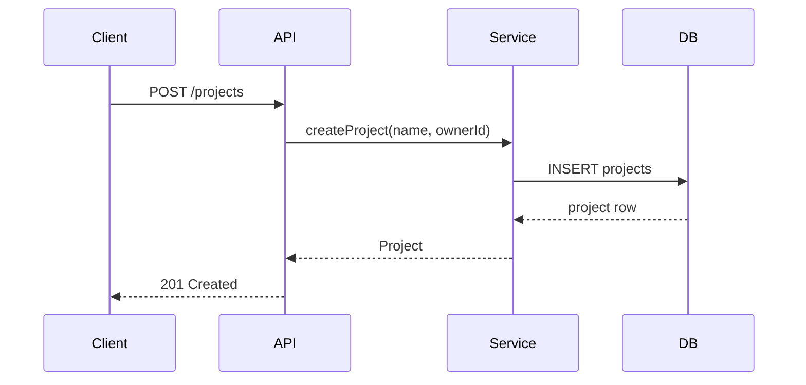

# Diagram Rules

Use Mermaid.js diagrams in planning documents only when they add clarity that prose cannot provide in three or fewer bullet points.

## Trigger condition

Include a diagram when the relationship or flow cannot be expressed clearly in ≤3 bullet points, or when ≥3 components interact. Skip diagrams for simple, single-component changes.

## Diagram type → use case mapping

Each type covers a distinct, mutually exclusive scenario. Select one.

| Type | Use when |
|------|----------|
| `flowchart` | Branching logic, decision trees, deployment topology, or option-comparison paths |
| `sequenceDiagram` | Time-ordered message passing between services, systems, or actors |
| `classDiagram` | Object relationships, inheritance, and interface structure in the domain model |
| `erDiagram` | Relational data model with entity attributes and cardinality |
| `stateDiagram-v2` | Entity lifecycle states and the transitions between them |

Good:
- 4 microservices exchanging messages → `sequenceDiagram`
- Comparing 3 notification delivery topologies → `flowchart`
- Domain model with 5 entities and foreign-key relationships → `erDiagram`
- Order status transitions (pending → confirmed → shipped → delivered) → `stateDiagram-v2`
- Repository and service inheritance → `classDiagram`

Bad:
- Use `sequenceDiagram` for a data model with no message ordering.
- Use `flowchart` for entity attribute relationships.
- Use `classDiagram` for a time-ordered API call chain.

## Placement rules

### Task issue — Context section

Embed the diagram after the prose explanation, before the Use Cases section. Use only when ≥3 components interact or the flow cannot be expressed in ≤3 bullets.

### ADR — Options Considered section

Embed one diagram per option set when options differ in topology, data flow, or system boundaries. Do not embed a diagram per individual option.

### CONTEXT.md — top-level overview

Embed an `erDiagram` or `classDiagram` immediately after the introductory paragraph when the domain model contains ≥4 entities. This gives readers a structural overview before the per-term glossary.

## Formatting rules

Wrap every diagram in a fenced Mermaid block:

````

````

- Add a diagram title as a comment when the diagram type supports it (`---\ntitle: ...\n---`).
- Limit diagrams to ≈10 nodes. If a diagram exceeds 10 nodes, simplify by grouping or nesting, or split into two focused diagrams.
- Use lowercase kebab-case node labels (`auth-service`, `notification-port`).

Good:
- 8-node `sequenceDiagram` with a title comment.
- `erDiagram` with 5 entities, each showing primary key and two foreign keys.

Bad:
- 20-node diagram that requires horizontal scrolling.
- Diagram with no context label — reader cannot identify what it models.

## Anti-patterns

**Diagram on every task**: Do not include a diagram because a section has a placeholder. Include only when the trigger condition is met.

**Redundant diagram**: Do not draw what the prose already says clearly in ≤3 bullets. Diagrams that repeat prose add noise.

**Overly complex diagram**: Do not embed a 15-node flowchart with nested subgraphs to cover every edge case. Simplify the diagram; use prose for edge cases.

**Wrong diagram type**: Do not use a `flowchart` for message timing or a `sequenceDiagram` for relational data. See the type → use case mapping above.

**Diagram without trigger**: Do not embed a diagram for a single-component change or a task whose behavior fits in two bullets.
