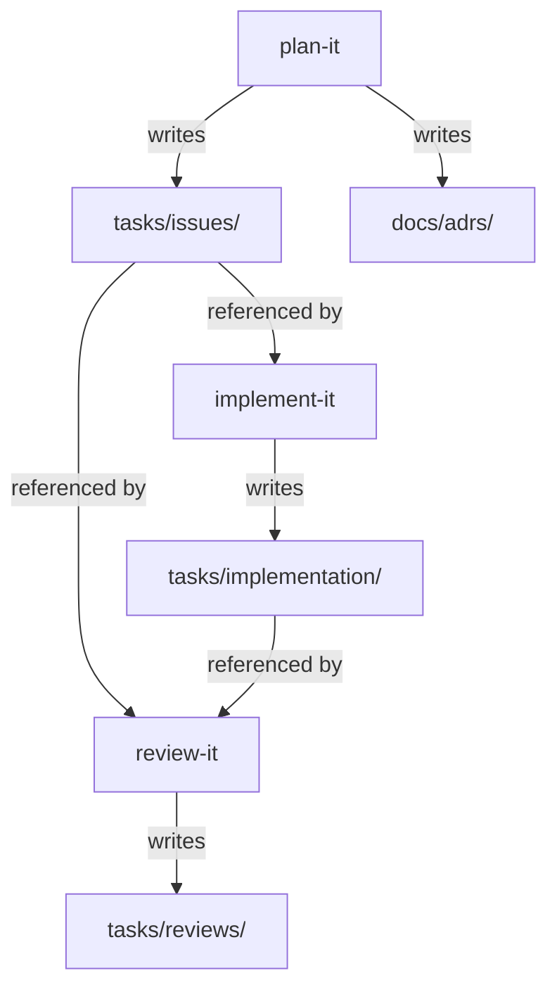

# Task: Group workflow output folders under a `tasks/` parent

## Priority

P0 — This refactor defines the output convention that all three skills (plan-it, implement-it, review-it) depend on. It must be done before any new skill invocations write output to the old flat paths, or before skill docs are treated as authoritative.

## Dependencies

- Depends on ADR `docs/adrs/001-separate-workflow-artifacts-from-adrs.md` — the decision to group workflow artifacts under `tasks/` while keeping ADRs at `docs/adrs/` must be documented before the refactor is applied.
- No task dependency; this is the first task in the sequence.

## Assignability

**AFK** — all paths are fully specified, the decision is captured in the ADR stub, and no irreversible changes are made to production data or external systems. The changes are limited to markdown documentation and shell scripts inside the skill definitions in this repository.

## Context

The three workflow skills currently write their outputs to three separate folders at the root of the target repository:

- `issues/` — task definition files created by plan-it
- `implementation/` — implementation summary files created by implement-it
- `reviews/` — review report files created by review-it

These three folders form a single lifecycle: a task is defined, implemented, and reviewed using a shared numeric prefix (e.g., `001-create-project`). Writing them to root-level folders pollutes the repository root and obscures the lifecycle relationship. Moving them under a shared `tasks/` parent makes the grouping explicit and keeps the root clean.

ADRs remain at `docs/adrs/` because they are long-lived architectural records — authoritative, cross-referenced, and consumed independently of any task lifecycle. They are not workflow artifacts.

The changes are purely to skill definition files (SKILL.md, reference markdown, templates, and shell scripts). No output files already written in existing repositories are migrated by this task.

## Use Cases

- **Feature**: Workflow artifact organization
- **Scenario**: Developer runs plan-it in a fresh repository
- **Given** a repository with no prior skill output
- **When** plan-it is invoked and creates issue files
- **Then** issue files appear at `tasks/issues/NNN-slug.md`, not at `issues/NNN-slug.md`

---

- **Feature**: Workflow artifact organization
- **Scenario**: Developer runs implement-it after plan-it
- **Given** `tasks/issues/018-slug.md` exists
- **When** implement-it writes the implementation summary
- **Then** the summary appears at `tasks/implementation/018-slug-summary.md`
- **And** the `issue` frontmatter field points to `tasks/issues/018-slug.md`

---

- **Feature**: Workflow artifact organization
- **Scenario**: Developer runs review-it and reads the issue
- **Given** the review-it skill has no path argument
- **When** review-it searches for the relevant issue
- **Then** it searches `tasks/issues/`, not `issues/`

## Definition of Ready

- ADR stub `docs/adrs/001-separate-workflow-artifacts-from-adrs.md` exists and is `Proposed`.
- All files to be changed are identified (see Functional Requirements).
- The decision is agreed: `tasks/` parent for workflow artifacts, `docs/adrs/` unchanged.

## Functional Requirements

- `FR-001`: plan-it writes issue files to `tasks/issues/` by default (SKILL.md, output-files.md, ensure-issues-dir.sh).
- `FR-002`: plan-it's issue numbering script uses `tasks/issues/` and `tasks/issues/_archive` as defaults (next-issue-number.sh).
- `FR-003`: implement-it writes implementation summaries to `tasks/implementation/` by default (SKILL.md, output-rules.md, ensure-implementation-dir.sh).
- `FR-004`: review-it writes review reports to `tasks/reviews/` by default (SKILL.md, output-rules.md, ensure-reviews-dir.sh).
- `FR-005`: review-it searches `tasks/issues/` when no issue argument is given (SKILL.md, review-rules.md).
- `FR-006`: review-it reads the implementation summary from `tasks/implementation/` (SKILL.md).
- `FR-007`: All path examples in templates reference the new `tasks/` paths (implementation-summary-template.md, review-report-template.md, adr-template.md).
- `FR-008`: All path examples in reference markdown files reference the new `tasks/` paths (plan-it/references/output-files.md, implement-it/references/output-rules.md, review-it/references/output-rules.md, review-it/references/review-rules.md).
- `FR-009`: ADR location (`docs/adrs/`) is unchanged across all files.
- `FR-010`: Scripts continue to accept an optional DIR argument to override the default path.

## Non-Functional Requirements

- `NFR-001`: Every internal cross-reference between skill files (e.g., implement-it referencing `tasks/issues/`) must use the same path as the canonical output location — no inconsistencies between SKILL.md, reference files, and templates within the same skill.
- `NFR-002`: The refactor does not add new abstractions, helpers, or functionality beyond path changes.

## Observability Requirements

Not applicable — this task changes only skill definition files (documentation and scripts). There is no runtime behavior, logging, metrics, or analytics involved.

## Acceptance Criteria

- `AC-001`: **Given** `ensure-issues-dir.sh` is called with no arguments, **When** it runs, **Then** it creates `tasks/issues/` and prints `ready: tasks/issues`.
- `AC-002`: **Given** `next-issue-number.sh` is called with no arguments in an empty directory, **When** it runs, **Then** it reads/writes `issues-lock.json` using `tasks/issues` and `tasks/issues/_archive` as the scan directories.
- `AC-003`: **Given** `ensure-implementation-dir.sh` is called with no arguments, **When** it runs, **Then** it creates `tasks/implementation/` and prints `ready: tasks/implementation`.
- `AC-004`: **Given** `ensure-reviews-dir.sh` is called with no arguments, **When** it runs, **Then** it creates `tasks/reviews/` and prints `ready: tasks/reviews`.
- `AC-005`: **Given** the plan-it SKILL.md, **When** it is read, **Then** every path example for issues uses `tasks/issues/` and every ADR example uses `docs/adrs/`.
- `AC-006`: **Given** the implement-it SKILL.md, **When** it is read, **Then** every path example for implementation summaries uses `tasks/implementation/`.
- `AC-007`: **Given** the review-it SKILL.md, **When** it is read, **Then** every path example for reviews uses `tasks/reviews/`, every reference to the issues directory uses `tasks/issues/`, and every reference to the implementation directory uses `tasks/implementation/`.
- `AC-008`: **Given** the implementation-summary-template.md, **When** it is read, **Then** the `issue` frontmatter field example and Related Task example use `tasks/issues/`.
- `AC-009`: **Given** the review-report-template.md, **When** it is read, **Then** the `issue` frontmatter field example, Related Task example, and finding examples use `tasks/issues/` and `tasks/reviews/`.
- `AC-010`: **Given** plan-it/references/output-files.md, **When** it is read, **Then** all `issues/` path examples use `tasks/issues/` and all `docs/adrs/` examples are unchanged.
- `AC-011`: **Given** review-it/references/review-rules.md, **When** it is read, **Then** all `issues/` path examples use `tasks/issues/` and all `reviews/` path examples use `tasks/reviews/`.
- `AC-012`: **Given** plan-it/assets/adr-template.md, **When** it is read, **Then** the Related Tasks example uses `tasks/issues/`.

## Required Tests

### Unit Tests

- `UT-001`: In a temporary directory, run `bash skills/plan-it/scripts/ensure-issues-dir.sh` with no args and assert the output is `ready: tasks/issues` and the `tasks/issues/` directory was created. Covers `AC-001`.
- `UT-002`: In a temporary directory, run `bash skills/plan-it/scripts/next-issue-number.sh` with no args and assert it creates `issues-lock.json` with `next_id: 2` and returns `001`, operating on `tasks/issues`. Covers `AC-002`.
- `UT-003`: In a temporary directory, run `bash skills/implement-it/scripts/ensure-implementation-dir.sh` with no args and assert the output is `ready: tasks/implementation` and `tasks/implementation/` was created. Covers `AC-003`.
- `UT-004`: In a temporary directory, run `bash skills/review-it/scripts/ensure-reviews-dir.sh` with no args and assert the output is `ready: tasks/reviews` and `tasks/reviews/` was created. Covers `AC-004`.

### Integration Tests

Not applicable — there is no integrated system behavior to test. The skills are markdown + bash scripts; correctness is verified by reading the files (ACs 005–012) and running the scripts (UTs 001–004).

### Smoke Tests

Not applicable — no service, deployment, or startup path is involved.

### End-to-End Tests

Not applicable — no user journey through a running application.

### Regression Tests

Not applicable — no prior defect is being fixed.

### Performance Tests

Not applicable — script execution time is negligible and not a risk here.

### Security Tests

Not applicable — no authentication, authorization, secrets, or trust boundaries are involved.

### Usability Tests

Not applicable — no UI.

### Observability Tests

Not applicable — no logs, metrics, or traces.

## Definition of Done

- All 12 SKILL.md, reference markdown, template, and script files are updated to use `tasks/issues/`, `tasks/implementation/`, and `tasks/reviews/` as the canonical paths.
- All four shell scripts produce correct output for no-argument invocation (UT-001 through UT-004 pass).
- ADR `docs/adrs/001-separate-workflow-artifacts-from-adrs.md` is updated from `Proposed` to `Accepted`.
- No `docs/adrs/` path changed in any file.
- No unrelated files modified.
